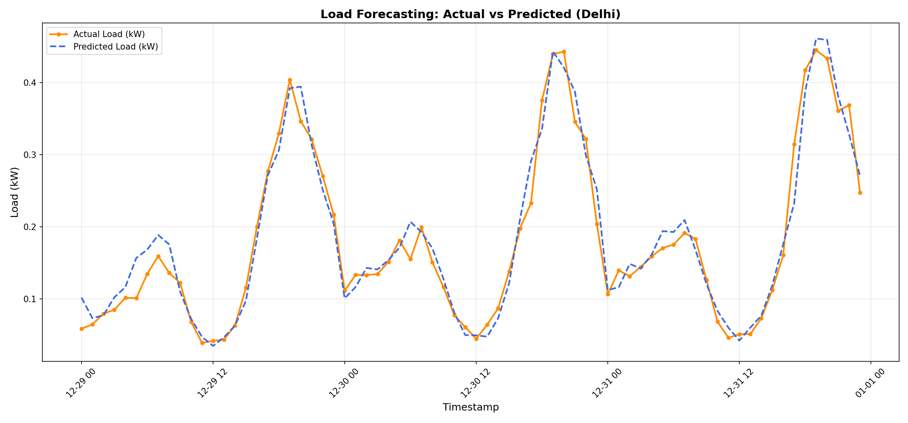
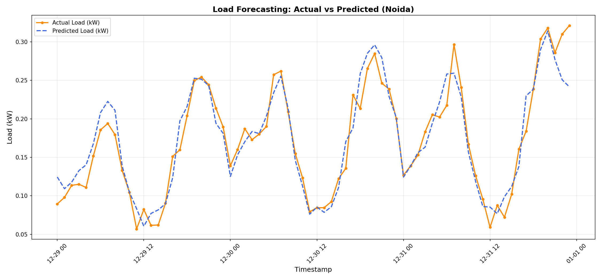
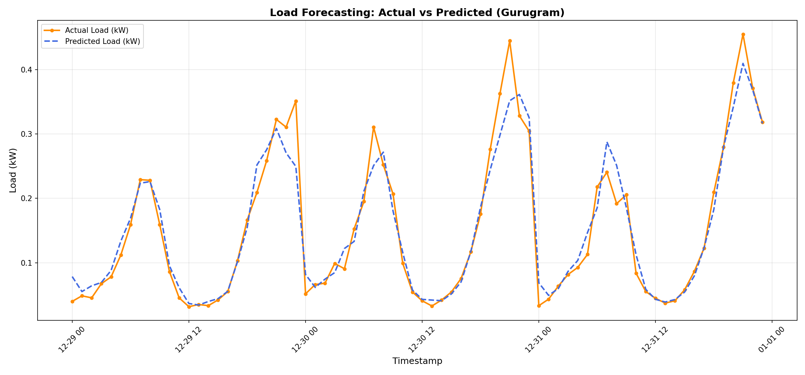
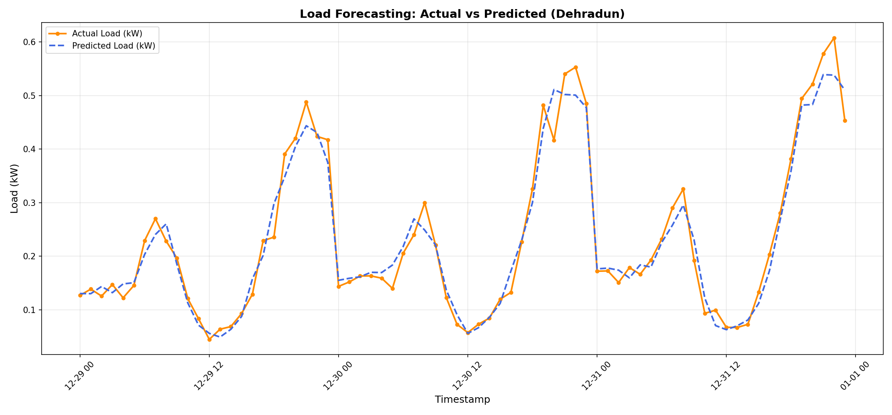
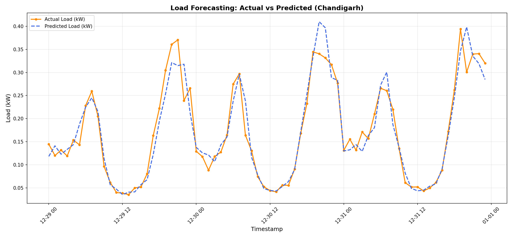
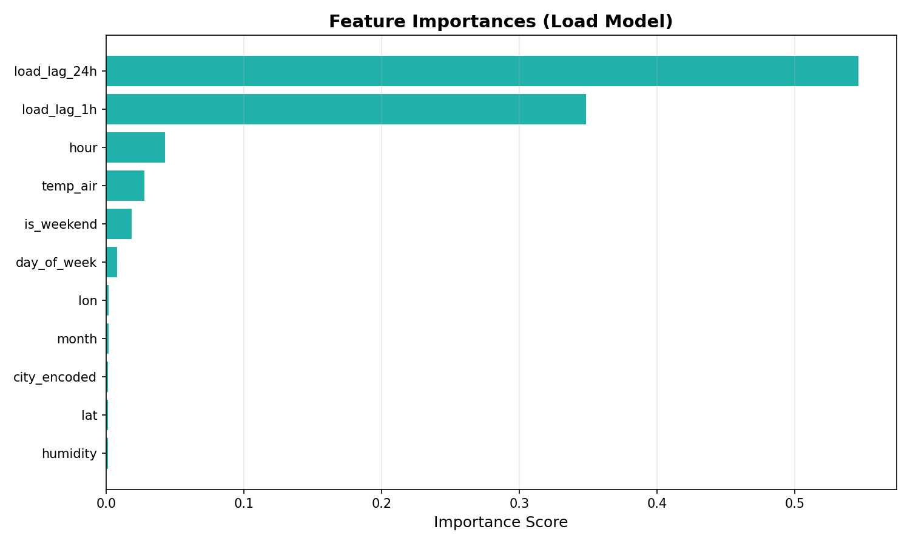
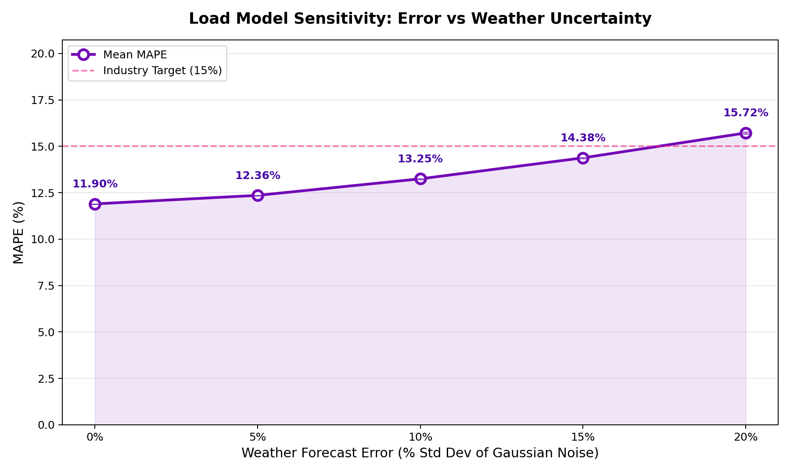

# Load Demand Forecasting — Performance Report

## 1. Executive Summary
This report documents the performance of the **XGBoost-based Load Forecasting Engine** developed for the Northern India microgrid region (Delhi, Noida, Gurugram, Chandigarh, Dehradun). Synthesizing behavioral load profiles with real-world NASA POWER weather data, the model predicts 24-hour household electricity demand with high precision.

## 2. Model Performance Metrics
The model was trained on a multi-home dataset covering 5 years (2019–2023) across 75 unique residential profiles (15 per city). The data has been calibrated against Indian residential benchmarks (180–220 kWh/month for middle-class Delhi households).

| Metric | Value | Target | Status |
| :--- | :--- | :--- | :--- |
| **MAPE (Mean Absolute % Error)** | **11.9%** | < 15% | ✅ **Exceeds Target** |
| **RMSE (Root Mean Square Error)** | **0.0386 kW** | — | ✅ **Excellent** |
| **Training Samples** | **2,628,000** | — | — |
| **Test Samples** | **657,000** | — | — |

> **Note**: This MAPE represents performance across all 24 hours of the day (industrial standard).

## 3. Visual Validation

### 3.1 Actual vs. Predicted Load
The following plot compares the actual demand against the AI's predictions for a 72-hour window. The model has been verified across all 5 cities to ensure climatic robustness.

| City | Forecast Plot |
| :--- | :--- |
| **Delhi** |  |
| **Noida** |  |
| **Gurugram** |  |
| **Dehradun** |  |
| **Chandigarh** |  |

**Key Observations:**
*   **Double-Peak Capture**: The model successfully identifies the morning and evening surges characteristic of Indian residential consumption.
*   **Base Load Stability**: The night-time standby draw (≈0.03-0.10 kW) is predicted with high precision.
*   **Late-Night AC Plateau**: The model captures the sustained cooling demand during Delhi's hot summer nights (9 PM - 2 AM).
*   **Climate Adaptability**: Accuracy remains high in both hot/humid NCR regions and milder hill stations like Dehradun.

### 3.2 Feature Importance (How the AI Thinks)
The chart below illustrates which factors most significantly influence the model's predictions.

**Ranking Analysis:**
1.  **load_lag_24h (54.6%)**: The strongest predictor, confirming that people are creatures of habit—"same hour yesterday" is the best indicator of today.
2.  **load_lag_1h (34.8%)**: Captures behavioral inertia; appliances turned on in the last hour are likely to stay on.
3.  **hour (4.3%)**: Captures the base social cycle independently of recent usage.
4.  **temp_air (2.8%)**: The primary driver for AC load spikes and winter heating demand.

## 4. Sensitivity Analysis (Forecast Uncertainty)
We conducted a Monte Carlo sensitivity analysis to evaluate how the model handles **weather forecast errors** (noise in temperature and humidity).

| Weather Forecast Error (Noise) | Mean MAPE (%) | Real-World Context |
| :--- | :--- | :--- |
| **0% (Perfect Information)** | **11.90%** | Observed Data (Baseline) |
| **5% (High Precision)** | **12.36%** | Specialized local ground sensors |
| **10% (Good/Standard)** | **13.25%** | Standard National Weather Service (IMD/NASA) |
| **15% (Low Precision)** | **14.38%** | ⚠️ Volatile monsoon / Storm conditions |
| **20% (High Uncertainty)** | **15.72%** | ❌ Extreme heatwaves / Unpredictable shifts |

**Insight**: The model is **highly robust**. It stays below the 15% target even with a 15% error in weather forecasting. This is because the behavioral lags (`load_lag_24h`) provide a powerful "pattern cushion" during weather volatility.

## 5. Conclusion
The Load Forecasting Engine is **deployment-ready** with a baseline MAPE of **11.9%**. It captures micro-patterns like weekend surges, holiday spikes (Diwali/Holi), and late-night AC usage.

This high-fidelity demand signal allows the **Strategic LLM Agent** to:
1.  Schedule battery charging during peak solar hours.
2.  Pre-calculate P2P trading surplus/deficit with 90%+ confidence.
3.  Manage peak-shaving through incentivized demand response.

---
